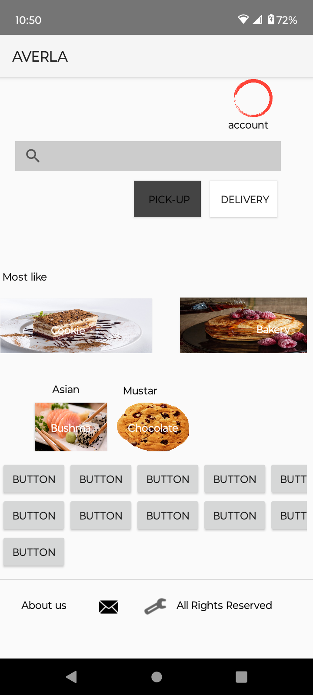
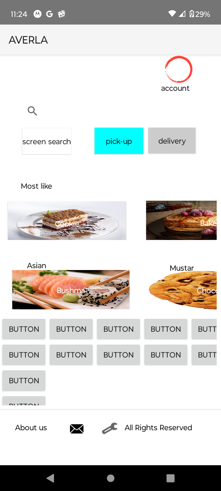
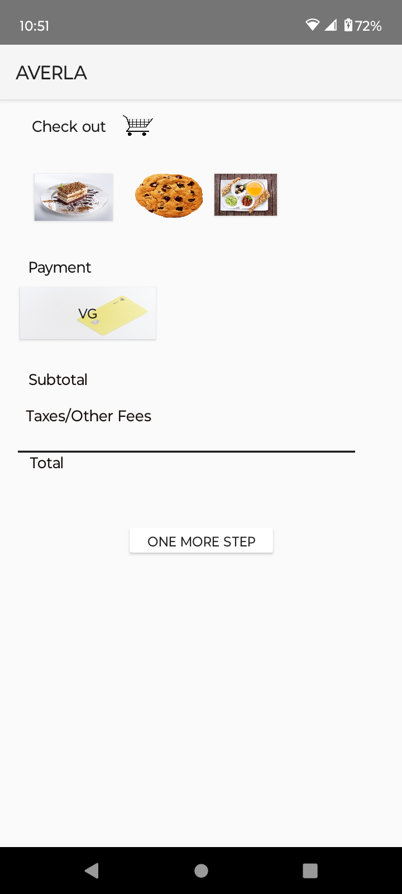

# Averla
Food delivery app services
User Registration and Login: Users can create an account or log in using their email or social media accounts.
Restaurant Search and Filter: Users can search for restaurants by name, cuisine, or location and apply various filters like ratings, price range, and delivery time.
Menu Browsing: Users can view the full menu of each restaurant, complete with descriptions, prices, and images.
Order Customization: Users can customize their orders with specific preferences and add special instructions for the restaurant.
Real-Time Tracking: Users can track their order status in real-time, from preparation to delivery.
Multiple Payment Options: Users can pay for their orders using credit/debit cards, digital wallets, or cash on delivery.
Order History: Users can view their past orders and reorder their favorite meals with ease.
Ratings and Reviews: Users can rate and review restaurants and dishes to help other users make informed decisions.

Step 1

Step 2

Step 3

